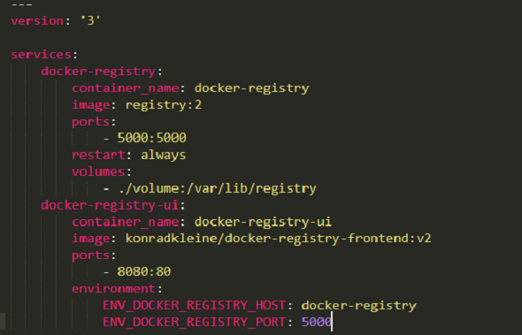
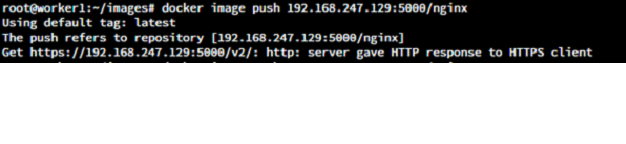

# Docker For NodeJs.

## Requirement
```
1) Install Docker in server
2) Git Repository
3) Dockerfile
4) Auto-deployment (GitLab CICD)
```
- <h2> How to Install Docker in your server(Flavorr: ubuntu 18.04 LTS) </h2>

  ```
  1) Using Script
  2) Manually install
  ```
- <h3> Using Script </h3>

  ```bash
  curl -fsSL https://get.docker.com -o get-docker.sh
  sudo sh get-docker.sh
  ```
- <h3> Manually Install </h3>

  ```bash
  Step 1: sudo apt-get update
  Step 2: sudo apt-get install \
      ca-certificates \
      curl \
      gnupg \
      lsb-release
  Step 3: curl -fsSL https://download.docker.com/linux/ubuntu/gpg | sudo gpg --dearmor -o /usr/share/keyrings/docker-archive-keyring.gpg
  Step 4: echo \
    "deb [arch=$(dpkg --print-architecture) signed-by=/usr/share/keyrings/docker-archive-keyring.gpg] https://download.docker.com/linux/ubuntu \
    $(lsb_release -cs) stable" | sudo tee /etc/apt/sources.list.d/docker.list > /dev/null
  Step 5: sudo apt-get update
  step 6: sudo apt-get install docker-ce docker-ce-cli containerd.io
  ```

- <h2> How to create Docker image in Nodejs Project </h2>

  - <h3> Clone Git Project To Dev Server</h3>

    ```bash
    Path - /home/node/
    git clone <git URL>
    cd Project_Name
    ```
  - <h3> Create Dockerfile </h3>

    ```Dockerfile
    FROM node:10.19.0
      
    RUN mkdir -p /usr/scr/app

    WORKDIR /usr/scr/app

    COPY . .

    RUN npm install

    EXPOSE 3000

    CMD [ "node", "app_socket.js", "3000" ]

    ```

- <h2> Docker commands </h2>

  ```bash
  docker image build -t "image name" .
  ```

- <h2> Auto-deployment (GitLab CICD) </h2>

  ```yaml
  stages:
    - Build image

  image: docker:stable
  docker_build:
    stage: Build image

    variables:
      CONTAINER_IMAGE: gitlab.artoon.in:6000/hdworks/8pool-ball-nodejs:${CI_COMMIT_SHORT_SHA}
    
    tags:
      - kube-docker
    script:
      - docker info
      - docker build -t ${CONTAINER_IMAGE} .
      - docker tag ${CONTAINER_IMAGE} ${CONTAINER_IMAGE}
      - docker tag ${CONTAINER_IMAGE} gitlab.artoon.in:6000/hdworks/8pool-ball-nodejs:latest
      - docker login -u $CI_REGISTRY_USER -p $CI_REGISTRY_PASSWORD $CI_REGISTRY
      - docker push ${CONTAINER_IMAGE}
    when: manual

  ```
# Create the Private Repository for the Kubernetes.

- <h2>Install the docker-compos in the master machine.</h2>

  ```bash
  - sudo curl -L https://github.com/docker/compose/releases/download/1.21.2/docker-compose-`uname -s`-`uname -m` -o /usr/local/bin/docker-compose

  - sudo chmod +x /usr/local/bin/docker-compose
  - docker-compose --version
  ```

- <h2>Create the docker-compos directory.</h2>

  ```bash
  - mkdir docker-compos
  ```

- <h2>Create the docker-compos.yml file in this folder.</h2>

  ```bash
  - vim docker-compos.yml
  ```

  
  - <h3>docker-compos.yml file link.</h3>

    [https://drive.google.com/file/d/120u09J8AbygAimYXFrgiF1fqlFprl4P2/view?usp=sharing](https://drive.google.com/file/d/120u09J8AbygAimYXFrgiF1fqlFprl4P2/view?usp=sharing)

- <h2>create the docker-compose container.</h2>

  ```bash
  - docker-compose -f docker-compos.yml up -d
  ```
  ```bash
  check in your browser

  http://192.168.247.136:8080/home
  (Your Machine Ip)
  ```

# How to Pull-Push Image in Private Repository.

- <h2>Now Assign the tag of when you have to create image.</h2>

  ```bash
  docker tag ubuntu:apache server_ip:5000/ubuntu:apache
                            Example:
  docker tag ubuntu:apache 192.168.247.136:5000/ubuntu:apache
  ```
- <h2>Now you can push the image in Private Repository.</h2>

  ```bash
  docker push server_ip:5000/ubuntu:apache
                            Example:
  docker image push 192.168.247.136:5000/ubuntu:apache
  ```

- <h2>if you face this type of error you can follow this steps</h2>

  
  
  - <h3>You can add the one file in client machine(worker node)</h3>

    ```bash
    Create the new file:
    - vim daemon.json

    {
       "insecure-registries" : ["192.168.247.136:5000"]
    }

    Then restart the docker service
    - service docker restart
    ```

