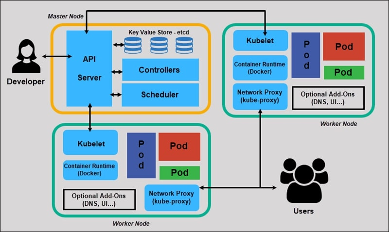
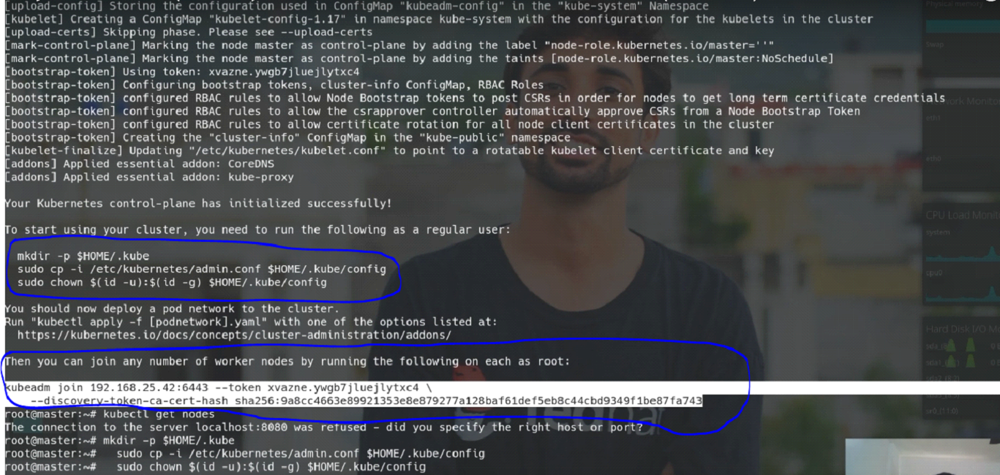

# Kubernetes Deployments

## Requirement

  ```
  1) Kubernetes Architecture
  2) Create Master and Slave Cluster
  3) Git Repository
  4) Dockerfile
  5) Kubernetes Pods YAML File
  6) Service YAML File
  7) Auto-deployment (GitLab CICD)
  8) Kubernetes Dashboard
  ```
- <h2> Kubernetes Architecture </h2>

    

- <h3> What is Kubernetes? </h3>

  ```yaml
  Kubernetes is an open source orchestration tool developed by Google for managing microservices or containerized applications across a distributed cluster of nodes. Kubernetes provides highly resilient infrastructure with zero downtime deployment capabilities, automatic rollback, scaling, and self-healing of containers (which consists of auto-placement, auto-restart, auto-replication , and scaling of containers on the basis of CPU usage).
  ```
- <h2> Master Components </h2>
- <h3> etcd cluster </h3>

  ```yaml
  A simple, distributed key value storage which is used to store the Kubernetes cluster data (such as number of pods, their state, namespace, etc), API objects and service discovery details. It is only accessible from the API server for security reasons. etcd enables notifications to the cluster about configuration changes with the help of watchers. Notifications are API requests on each etcd cluster node to trigger the update of information in the node’s storage.
  ```
- <h3> kube-apiserver </h3>

  ```yaml
  Kubernetes API server is the central management entity that receives all REST requests for modifications (to pods, services, replication sets/controllers and others), serving as frontend to the cluster. Also, this is the only component that communicates with the etcd cluster, making sure data is stored in etcd and is in agreement with the service details of the deployed pods.
  ```
- <h3> kube-controller-manager  </h3>

  ```yaml
  runs a number of distinct controller processes in the background (for example, replication controller controls number of replicas in a pod, endpoints controller populates endpoint objects like services and pods, and others) to regulate the shared state of the cluster and perform routine tasks. When a change in a service configuration occurs (for example, replacing the image from which the pods are running, or changing parameters in the configuration yaml file), the controller spots the change and starts working towards the new desired state.
  ```

- <h3> cloud-controller-manager </h3>

  ```yaml
  cloud-controller-manager is responsible for managing controller processes with dependencies on the underlying cloud provider (if applicable). For example, when a controller needs to check if a node was terminated or set up routes, load balancers or volumes in the cloud infrastructure, all that is handled by the cloud-controller-manager.
  ```

- <h3> kube-scheduler </h3>

  ```yaml
  helps schedule the pods (a co-located group of containers inside which our application processes are running) on the various nodes based on resource utilization. It reads the service’s operational requirements and schedules it on the best fit node. For example, if the application needs 1GB of memory and 2 CPU cores, then the pods for that application will be scheduled on a node with at least those resources. The scheduler runs each time there is a need to schedule pods. The scheduler must know the total resources available as well as resources allocated to existing workloads on each node.
  ```
- <h2> Node (worker) components <h2>

- <h3> kubelet </h3>

  ```yaml
  The main service on a node, regularly taking in new or modified pod specifications (primarily through the kube-apiserver) and ensuring that pods and their containers are healthy and running in the desired state. This component also reports to the master on the health of the host where it is running
  ```

- <h3> kube-proxy  </h3>

  ```yaml
  A proxy service that runs on each worker node to deal with individual host subnetting and expose services to the external world. It performs request forwarding to the correct pods/containers across the various isolated networks in a cluster.
  ```
- <h3> Kubectl </h3>

  ```yaml
  kubectl command is a line tool that interacts with kube-apiserver and send commands to the master node. Each command is converted into an API call.
  ```
# How to Create Master and Slave Cluster
- <h2>Create the 3 Virtual Machine and install the OS of Ubuntu 18.04 LTS.</h2>

  ```bash
  - Master Machine
  - Worker 1
  - Worker 2

  Configuration of Machines:
  - RAM : Min 2 GB
  - HDD: Min 30 Gb
  - Processor: Min 2 Processor (it’s mediatory)
  ```
- <h2>After Ubuntu Installation Check the swap memory is on or off in all machine?<h2>

    ```bash
    Command:
    - free -h

    Disable to swap memory
    Command:
    - sudo swapoff -a

    fstab disable for:
    - sudo vim /etc/fstab
      comment the 1 st line.
    ```
- <h2>Docker install in all machine.</h2>

  Ref. Link: [https://docs.docker.com/engine/install/ubuntu/](https://docs.docker.com/engine/install/ubuntu/)
  ```bash
  - curl -fsSL https://get.docker.com -o get-docker.sh
  - sudo sh get-docker.sh
  ```
- <h2>Install the kubeadm and kubectl ALL MACHINE.</h2>

  Ref. Link: [https://kubernetes.io/docs/setup/production-environment/tools/kubeadm/install-kubeadm/](https://kubernetes.io/docs/setup/production-environment/tools/kubeadm/install-kubeadm/)

  ```bash
  - sudo apt-get update && sudo apt-get install -y apt-transport-https curl
  - curl -s https://packages.cloud.google.com/apt/doc/apt-key.gpg | sudo apt-key add -
  - cat <<EOF | sudo tee /etc/apt/sources.list.d/kubernetes.list
     deb https://apt.kubernetes.io/ kubernetes-xenial main
     EOF
  - sudo apt-get update
  - sudo apt-get install -y kubelet kubeadm kubectl
  ```
- <h2>You can install only one Pod network per cluster. Below you can find installation instructions for some popular Pod network plugins: (Only Master Machine)</h2>

  ```bash
  Command:
  - kubeadm init --pod-network-cidr=10.244.0.0/16
  ```  
  

- <h2>To start using your cluster, you need to run the following as a regular user:</h2>

  ```bash
  Command:
  - mkdir -p $HOME/.kube
  - sudo cp -i /etc/kubernetes/admin.conf $HOME/.kube/config
  - sudo chown $(id -u):$(id -g) $HOME/.kube/config
  ```
- <h2>For the Add the Flannel network name space add and core DNS then run this command for running all master and worker1 and worker2</h2>

  ```bash
  Command:
  - kubectl apply –f https://raw.githubusercontent.com/coreos/flannel/2140ac876ef134e0ed5af15c65e414cf26827915/Documentation/kube-flannel.yml
  ```
- <h2>Then you can join any number of worker nodes by running the following on each as root: (Run command in All Worker Nodes)</h2>

  ```bash
  Command: 
  - kubeadm join 192.168.43.131:6443 --token 1ip6yx.l4oifdpvbesghw12 \
    --discovery-token-ca-cert-hash sha256:b3b1b3f2fa2bb52db856353d043ecf02a03c0837e08dbc33096bf14e5db8dbac
  ```

- <h1>Deployment in Kubernetes</h1>

  - <h2> Clone Git Project To Dev Server. </h2>

    ```bash
    Path - /home/node/
    git clone <git URL>
    cd Project_Name
    ```

  - <h2> Create Dockerfile </h2>

    ```Dockerfile
    FROM node:10.19.0
      
    RUN mkdir -p /usr/scr/app

    WORKDIR /usr/scr/app

    COPY . .

    RUN npm install

    EXPOSE 3000

    CMD [ "node", "app_socket.js", "3000" ]

    ```

  - <h2> Docker commands </h2>
  
     ```bash
      docker image build -t "image name" .
    ```

  - <h2> Kubernetes Pods YAML File </h2>

    ```yaml
    apiVersion: apps/v1
    kind: Deployment
    metadata:
      name: hdworks-8pool-ball
      labels:
        app: hdworks-8pool-ball
    spec:
      replicas: 1
      selector:
        matchLabels:
          app: hdworks-8pool-ball
      template:
        metadata:
          labels:
            app: hdworks-8pool-ball
        spec:
          containers:
            - name: hdworks-8pool-ball
              image: gitlab.artoon.in:6000/hdworks/8pool-ball-nodejs:<VERSION>
              ports:
                - containerPort: 3017
          imagePullSecrets:
            - name: dhruvil

    ```
  - <h2> Service YAML File </h2>

    ```yaml
    apiVersion: v1
    kind: Service
    metadata:
      name: hdworks-8pool-ball
    spec:
      type: NodePort
      selector:
        app: hdworks-8pool-ball # selector for deployment
      ports:
      - name: example-port
        protocol: TCP
        port: 1234 # CLUSTERIP PORT
        targetPort: 6158 # POD PORT WHICH APPLICATION IS RUNNING ON 
        nodePort: 32239 # HERE!
    ```
  - <h2> Kubernetes Basic Commands</h2>

    ```bash
    kubectl apply -f "pods YAML file name"
    kubectl apply -f "service YAML file name"
    ```

  - <h2> Auto-deployment (GitLab CICD) </h2>

    ```yaml
    stages:
      - Build image
      - deploy

    image: docker:stable
    docker_build:
      stage: Build image

      variables:
        CONTAINER_IMAGE: gitlab.artoon.in:6000/hdworks/8pool-ball-nodejs:${CI_COMMIT_SHORT_SHA}
      
      tags:
        - kube-docker
      script:
        - docker info
        - docker build -t ${CONTAINER_IMAGE} .
        - docker tag ${CONTAINER_IMAGE} ${CONTAINER_IMAGE}
        - docker tag ${CONTAINER_IMAGE} gitlab.artoon.in:6000/hdworks/8pool-ball-nodejs:latest
        - docker login -u $CI_REGISTRY_USER -p $CI_REGISTRY_PASSWORD $CI_REGISTRY
        - docker push ${CONTAINER_IMAGE}
      when: manual

    docker_Deploy:
      stage: deploy
      tags:
        - kube-ssh
      script:
        - sed -i "s/<VERSION>/${CI_COMMIT_SHORT_SHA}/g" node-rolling-update.yml
        - cat node-rolling-update.yml
        - kubectl apply -f node-rolling-update.yml
      when: manual
    ```
  - <h2> Kubernetes Dashboard </h2>

    - <h3> Kubernetes Dashboard URL </h3>

      [Kubernetes Dashboard URL](https://kube.artoon.in:32434/#/login)


